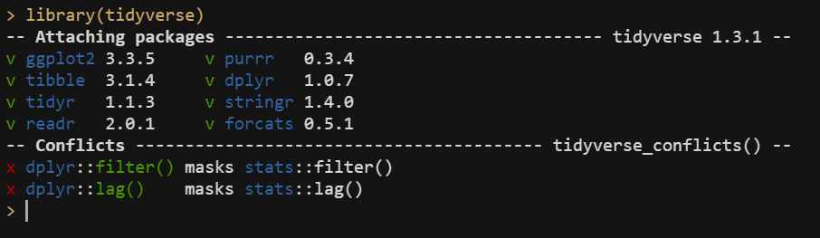
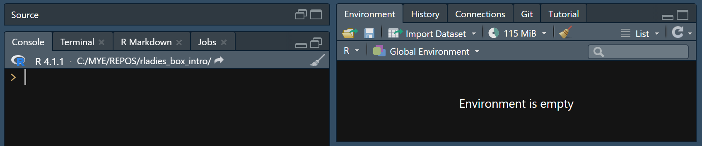
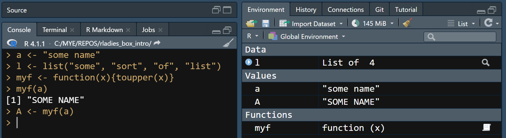
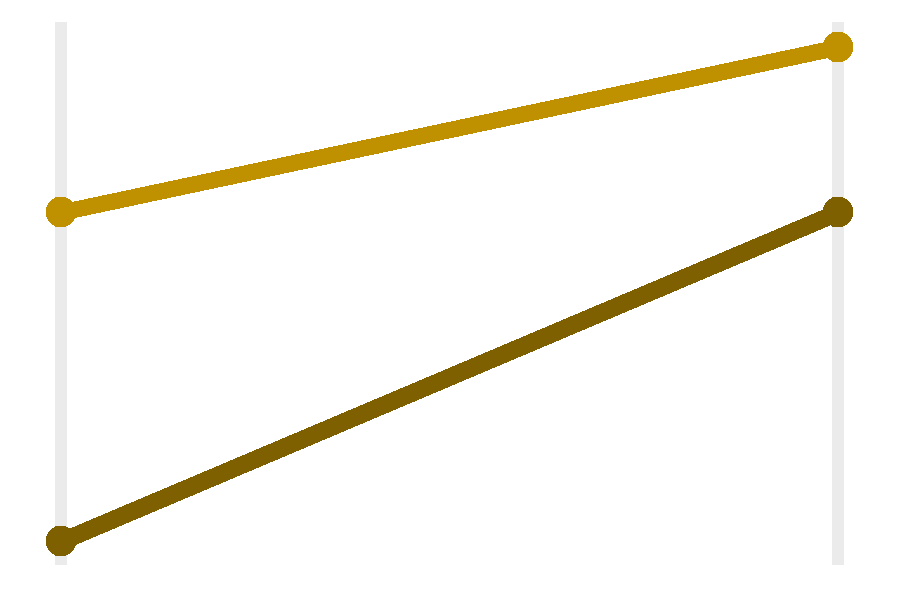

# TEST 

```{r}
print("x")
```


<div class="sourceCode" id="cb1"><pre class="sourceCode r"><code class="sourceCode r"><span id="cb1-1"><a href="#cb1-1" aria-hidden="true" tabindex="-1"></a><span class="fu">print</span>(<span class="st">&quot;x&quot;</span>)</span></code></pre></div>
<pre><code>## [1] &quot;x&quot;</code></pre>


# Goal of this talk

Introduce the `{box}` package and show how it can be used to write modularized/organized code and manage the name space.  

**Disclaimer:** I have been using this package for about 6 months and I'm still learning new things everyday!  Please ask as many questions as you want, but I may not know the answer.  

### Packages Used in the Making of this Presentation

- `{box}`
- `{glue}`
- `{tidyverse}` specifically `{ggplot2}`, `{dplyr}`, `{stringr}`, and `{tidyr}`


# `{box}` 

- `{box}` is a relatively new package 
- first version released on GitHub is [0.9.8](https://github.com/klmr/box/releases/tag/version-0.9.8) in July 2017
- first version available on CRAN is [1.0.0](https://cran.r-project.org/src/contrib/Archive/box/) in February 2021
- Current version [1.1.0](https://cloud.r-project.org/web/packages/box/index.html) released in September 2021

# Why? 

- Clean-up/Manage name space 
- Modular-ize code without having to write full package 
  * purposeful and organized code 
  * if change codde within box module, importation of box module doesn't change 

Box modules are like mini-packages: help re-use or share code without the much larger hurdle of developing a whole R package 

- re-use code for yourself if doing similar actions frequently 
- share code internally with peers/colleague (create consistency)
- share externally


# Name Space

<div id = "contentbox", style = "width: 100%; display: block; margin-left: auto; margin-right: auto;">
  <div id="column1" style="float:left; width:40%;">
    Name space: group of items (data frames, functions, vectors, lists, etc.) that each have a unique name. <br>
      
    <ul>
      <li><code>{dplyr}</code> and <code>{stats}</code> use the same name for certain functions, CONFLICT in the namespace</li>
      <li>If want to use the </code>{stats}</code> function, have to refer to the package: </code>stats::filter()</code></li>
    </ul>
  </div>
  <div id="column2" style="float:right; width:58%;">
    <center><b>R Environment: Global Environment</b></center>
      
    
  </div>
</div>

# Modular-ize 

- put code in to 'modules' or sections
- can have each module for a specific situation or group fo functions
- other coding languages used in data science have this capability as well 
  * C++ with namespace 
  * Python with modules/packages
  * JavaScript with node modules 

# Quick Example: Different Ways of Coding 

- data set with both character and numeric variables 
- want to create multiple plots 
- two types of plots  

<small>*Note:* this is a simplified version of the example in the `DIR_ROOT` folder of the repository, using `mpg` data from the `{ggplot2}`</small>  

<div id = "contentbox", style = "width: 80%; display: block; margin-left: auto; margin-right: auto;">
  <div id="column1" style="float:left; width:49%;">
    <center><b>A: Frequency Bar Plot</b><br>Character or Discrete Numeric Variables</center>
      
  </div>
  <div id="column2" style="float:right; width:49%;">
    <center><b>B: Slope Plot</b><br>Mean of Continuous Numeric Variable at Two Points</center>
      
  </div>
</div>
<br> 


# Option 1: Write out code for each plot 

 


More situations/dimensions: 

- more mess and less organization 
- more name space usage 
- bad practice to continue to repeat code  

# Option 2: Multiple Functions 

 

More situations/dimensions &#8658; more functions: 

- more name space usage  
- difficult to maintain and keep consistency (i.e. formatting across plots) 


# Option 3: One Long Function 

 

More situations/dimensions &#8658; Longer function

- difficult to maintain because of large size 
- difficult to test (one part of the function breaks, entire function won't work) 


# Option 4: &#127775; Using Box Modules &#127775;

## Create Box Modules (`.R` files )

 

## Use in `.Rmd` or `.R` files  

 

- only box modules are in the name space
- can use any **exported** functions (using the `'# @export`)


**More situations/dimensions &#8658; add/amend box modules**

- Self-contained code in box module 
- Refer to other box modules within a specific modules 
- Test within a specific box module 
- Break up long functions into multiple functions but only export the final function 
- Much smaller usage of name space 
- Easier to share with internally/externally 


# Box: Structure 

- Box modules are simply `.R` files with specific instructions
- Best to put all modules into a folder to keep organized 
- Folder can be named anything (I often see 'box' or 'modules')

How I structure my folders: 

<div style="font-family: monospace; background-color: #E9E9E9;">
DIR_ROOT  
|  
|---myboxes #folder can have any name  
|   |  
|   |---Abox.R   
|   |---Bbox.R  
|   
|---my.Rmd  #main RMD file that will generate report/html
</div>

- how you call box modules will depend on the structure of folders 
- similar to including images or sourcing (`source(file.R)`)


# Box: Packages

- when starting your box module will need to use package (e.g. `{ggplot2}`, `{dplyr}`, etc.)
- Usualy load packages using `library()` command 
- **!! NEED TO CALL PACKAGES/FUNCTIONS USING `box::use()`, NOT `library()` !!**

<div class = "quote">
`box::use` is a **universal import declaration**. It works for packages just as well as for modules. In fact, ‘box’ completely replaces the base R `library` and `require` functions. `box::use` is more explicit, more flexible, and less error-prone than `library`. At its simplest, it provides a direct replacement
</div>
<div class = "quotesource"><a href = "https://klmr.me/box/#loading-code" target = "_blank" style = "color: black !important;">- klmr.me/box/#loading-code</a></div>


# Box: `box::use()` 

Common Box Declarations (with `{dplyr}` as example)

<div id = "contentbox2", style = "width: 90%; display: block; margin-left: auto; margin-right: auto; line-height: 150%;">
  <div id="column1" style="float:left; width:48%;">
    <center>
      <code>box::use(</code>
      <code><b>dplyr[...]</b></code>
      <code>)</code></b></center><br>
    - Imports <code>{dplyr}</code> and attached all exported names<br>
    - Similar to <code>library(dplyr)</code><br>
    - Use any <code>{dplyr}</code> functions without specifying the package name
  </div>
  <div id="column2" style="float:right; width:48%;">
    <center>
      <code>box::use(</code>
      <code><b>dplyr[filter, select]</b></code>
      <code>)</code></b></center><br>
    - Imports  <code>{dplyr}</code> and attaches the names <code>dplyr::filter</code> and <code>dplyr::select</code><br>
    - Use <code>filter()</code> and <code>select()</code> from <code>{dplyr}</code><br>
    - Would not be able to use <code>mutate()</code><br> 
    - Could use <code>dplyr::mutate()</code> to use 
  </div>
</div>


# Box: Write Your Functions/Code (boring text info)   

- can use anything in the box modules as dependencies for functions 
- only need to export the final functions you want to use outside of the module 
   * in order to export need to use `'# @export` 
- Use [Roxygen](https://cran.r-project.org/web/packages/roxygen2/vignettes/roxygen2.html): 
   * `#'` before each line with information on function 
   * `@param` details out the variable inputs (each input has own line) 
   * `@return` details what function returns 
   * `@export` export item, to use outside module [REQUIRED if want to use outside of module]
   * `@example` examples of using function 
   * can include as many or as few as you want (best practice to include all but I often don't, c'est la vie)
- Shortcut to Insert Roxygen Skeleton (need to have cursor within a function): 
  * Windows/Linux: Ctrl+Shift+Alt+R
  * Mac: Option+Shift+Command+R
  * Roxygen is a way to document code, it's used in the development of R packages

# Box: Write Your Functions/Code (simple example)

## Write Code 

```{r, eval = FALSE}
#following code is saved in box/text.R file 

```

## Import Box Module 

`box/test` 

- `box`: name of folder where `test.R` box module is located 
- `test`: name *without extenstion* of box module 

```{r}
box::use(
  box/test 
)
```


## Use Functions! 

- with CRAN packages use double colon `::` to call a function from a specific package
- with modules use `$` 


```{r}
test$say_hello("Martha")
```


